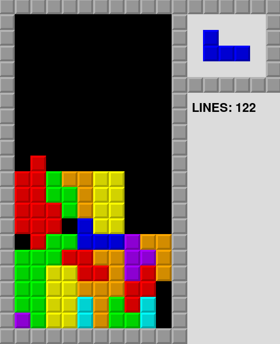

# Tetris

The tetris game with an AI.

It requires the [pygame](https://www.pygame.org/) library to run.

Usage: `python3 main.py`

Pressing <kbd>Space</kbd> will toggle on and off the AI.
You can play using the arrow keys when the AI is inactive.
